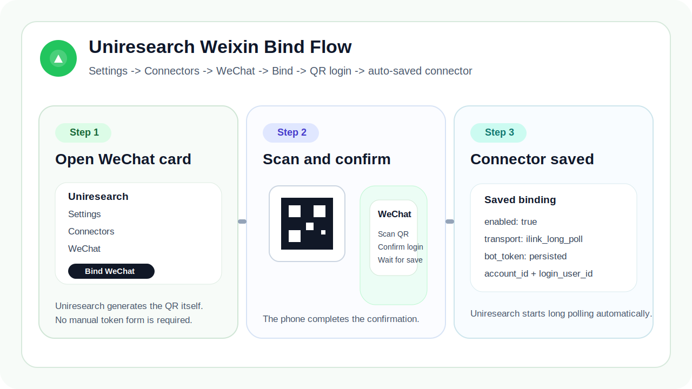
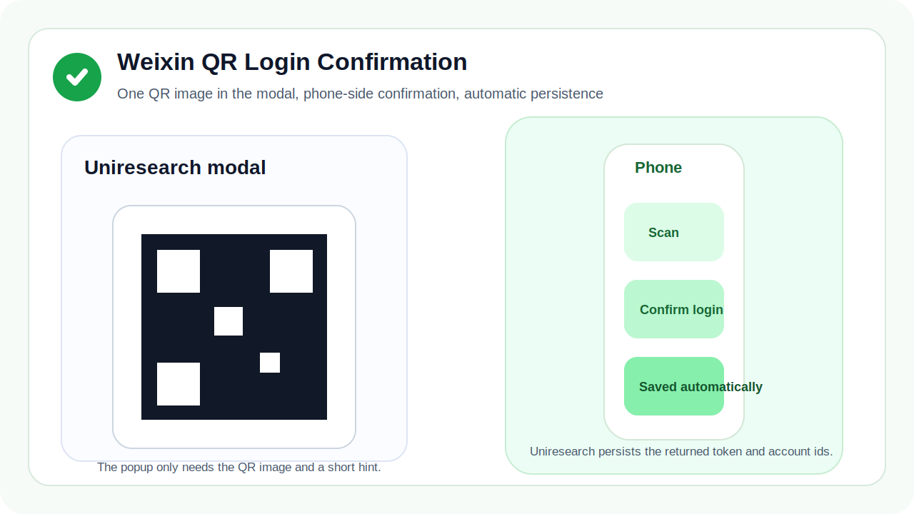
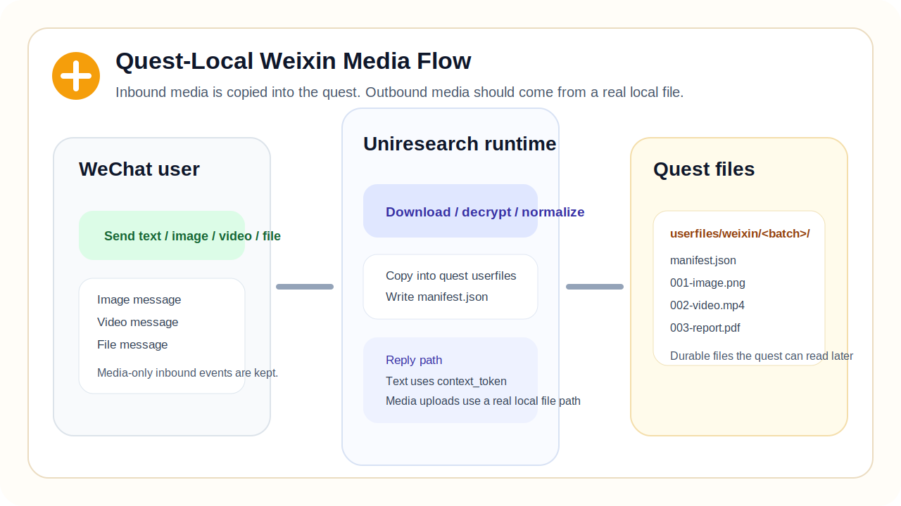

# 10 微信连接器指南：把个人微信绑定到 Uniresearch

这篇文档只讲 Uniresearch 内置的微信连接器，不讲 OpenClaw 安装。

Uniresearch 已经内置了微信 iLink 运行时，因此你不需要再额外执行：

- `npx`
- 单独安装 OpenClaw
- 再起一个本地桥接程序
- 配置公网 webhook

真正需要的绑定动作只有这四步：

1. 打开 `Settings > Connectors > WeChat`
2. 点击 `绑定微信`
3. 用微信扫码
4. 在手机微信里确认登录

确认完成后，Uniresearch 会自动保存微信 connector，并开始长轮询。

## 1. 这个连接器现在能做什么

绑定成功后，Uniresearch 现在可以：

- 接收微信文本消息
- 接收微信图片、视频、文件附件
- 把入站附件复制到当前 quest 的 `userfiles/weixin/...`
- 把文本回复发回同一个微信上下文
- 在 agent 提供真实本地文件时，发送微信原生图片、视频、文件
- 当微信绑定到 quest 时，在每次主实验完成后自动发送按指标生成的时间线图片

入站媒体不会只留在临时缓存里，而是会被复制进 quest。本地落盘路径形态如下：

```text
~/Uniresearch/quests/<quest_id>/userfiles/weixin/<message_batch>/
```

这意味着微信附件现在已经比较接近 QQ 的处理方式了：quest 能拿到真实、持久化的本地文件。



## 2. 绑定前先确认

开始前请先确认：

- Uniresearch 的 daemon 和网页已经正常启动
- 你可以打开 `Settings > Connectors > WeChat`
- 手机上已经登录了一个真实的个人微信账号，准备用它扫码

这张参考图只用于帮助你确认扫码时应使用已经登录目标微信账号的手机。真正的绑定动作仍然是在 Uniresearch 页面里弹出二维码后扫码完成，而不是去跑额外的 `npx` 工具。


## 3. 从 Settings 页面直接绑定

打开：

- [Settings > Connectors > WeChat](/settings/connectors#connector-weixin)

然后按顺序做：

1. 点击 `绑定微信`
2. 等待 Uniresearch 生成二维码
3. 用微信扫码
4. 在手机上确认登录

这里有几个关键点：

- 弹窗里只保留二维码这一张图，因为 Uniresearch 已经内置了完整的 iLink 登录流程
- 绑定过程中不需要手填 `bot_token`
- 二维码弹窗里不需要额外再点一次保存
- 平台一旦返回 `bot_token` 和账号信息，Uniresearch 会自动持久化

成功后，微信卡片里会显示：

- `机器人账号`
- `扫码账号`

这两项就是当前保存下来的微信绑定信息。



## 4. 绑定后怎么验证文本和多媒体

二维码登录成功后，建议按这个最短路径验证：

1. 在 `Start Research` 或项目界面把 quest 绑定到微信 connector
2. 从微信发一条文本、图片、视频或文件
3. 等待 Uniresearch 把它接入到 quest
4. 确认回复回到了同一条微信会话里

当前行为是：

- 入站文本会直接进入 quest，作为用户消息
- 入站图片、视频、文件会被下载并复制进 quest 本地 `userfiles/weixin/...`
- 纯媒体消息不会再被直接丢弃
- 出站文本会沿用运行时维护的 `context_token`
- 如果微信 `context_token` 缺失或过期，低优先级出站更新会先进入排队，而不是直接丢失
- 下一次新的微信入站刷新会话后，Uniresearch 只会回放最近 `5` 条排队更新，并且每条之间固定间隔 `2` 秒
- 出站图片、视频、文件在 agent 提供真实本地文件路径时可以正常发送
- 出站主实验指标图会自动作为微信原生图片发送



## 5. agent 发送微信多媒体时应怎么做

对用户来说，规则其实很简单：

- 只回文本时，正常回复即可
- 要发微信原生图片、视频、文件时，agent 必须给出一个真实的 quest 本地文件

所以 agent 最好优先使用这些目录中的真实文件：

```text
artifacts/...
experiments/...
paper/...
userfiles/...
```

而不是默认依赖一个任意的外链。

## 5.1 主实验指标图自动推送

当微信是当前 quest 的绑定连接器时，Uniresearch 现在会在每次主实验完成后自动发送指标时间线图片。

当前行为：

- 每个指标生成一张图
- 如果 baseline 存在该指标，会画一条横向虚线作为 baseline 参考线
- 系统会自动判断该指标是“越高越好”还是“越低越好”
- 超过 baseline 的点会额外标星
- 最新点使用莫兰迪深红色填充
- 较早的点使用莫兰迪深蓝色填充
- 如果指标有多个，Uniresearch 会按顺序发送，并在相邻两张图之间间隔约 2 秒

这些图来自 quest 本地生成的文件，并会作为微信原生图片自动发送到当前绑定会话。

## 6. 常见问题

### 二维码一直在等待

优先检查：

- 是否用的是你真正想绑定的那个微信账号扫码
- 手机里是否已经完成“确认登录”
- 等待期间 Uniresearch 是否持续在线

如果二维码过期，Uniresearch 会自动刷新。

### 为什么我只看到文本，没有看到入站多媒体

请用真实图片、视频或文件重测一次。成功后，quest 目录里应该能看到：

```text
userfiles/weixin/<message_batch>/manifest.json
```

以及旁边被复制下来的实际媒体文件。

## 7. 参考

- 菜鸟教程个人微信接入说明：https://www.runoob.com/ai-agent/openclaw-weixin.html
- 上游微信协议文档：https://github.com/hao-ji-xing/openclaw-weixin/blob/main/weixin-bot-api.md
